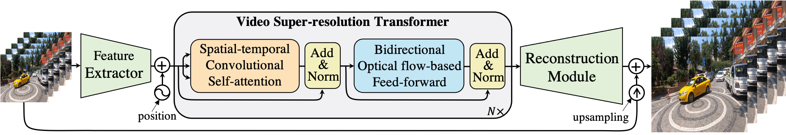
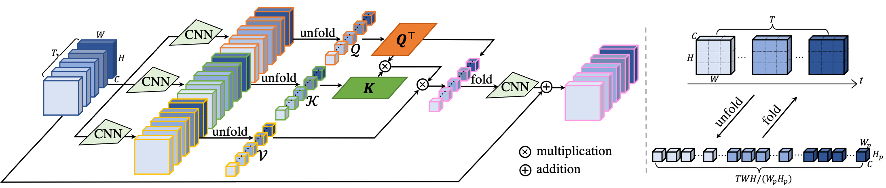
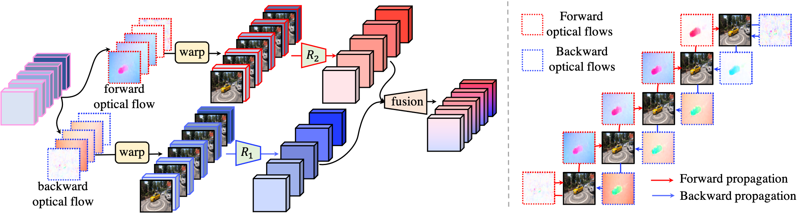

# VSR-Transformer

By [Jiezhang Cao](https://github.com/caojiezhang/), [Yawei Li](https://github.com/ofsoundof), [Kai Zhang](http://github.com/cszn), [Luc Van Gool](https://scholar.google.com/citations?user=TwMib_QAAAAJ&hl=en)

This paper proposes a new Transformer for video super-resolution (called VSR-Transformer). Our VSR-Transformer block contains a spatial-temporal convolutional self-attention layer and a bidirectionaloptical flow-based feed-forward layer. Our VSR-Transformer is able to improve the performance of VSR. This repository is the official implementation of ["Video Super-Resolution Transformer"](https://arxiv.org/abs/2106.06847).  

<p align="center"></p>
<p align="center"></p>
<p align="center"></p>

## Dependencies and Installation

- Python >= 3.7 (Recommend to use [Anaconda](https://www.anaconda.com/download/#linux) or [Miniconda](https://docs.conda.io/en/latest/miniconda.html))
- [PyTorch >= 1.3](https://pytorch.org/)
- NVIDIA GPU + [CUDA](https://developer.nvidia.com/cuda-downloads)

1. Clone repository

    ```bash
    git clone https://github.com/caojiezhang/VSR-Transformer.git
    ```

2. Install dependent packages

    ```bash
    cd VSR-Transformer
    pip install -r requirements.txt
    ```

3. Compile environment

    ```bash
    python setup.py develop
    ```


## Dataset Preparation

- Please refer to **[DatasetPreparation.md](docs/DatasetPreparation.md)** for more details.
- The descriptions of currently supported datasets (`torch.utils.data.Dataset` classes) are in [Datasets.md](docs/Datasets.md).


## Training

- Please refer to **[configuration of training](options/train/)** for more details and [pretrained models](https://drive.google.com/drive/folders/1HFZbuYq54U9mz_ngAqfW3pRMcry7XWx3?usp=sharing).  

    ```bash
    # Train on REDS
    CUDA_VISIBLE_DEVICES=0,1,2,3,4,5,6,7 python -m torch.distributed.launch --nproc_per_node=8 --master_port=4321 basicsr/train.py -opt options/train/train_vsrTransformer_x4_REDS.yml --launcher pytorch
    # Train on Vimeo-90K
    CUDA_VISIBLE_DEVICES=0,1,2,3,4,5,6,7 python -m torch.distributed.launch --nproc_per_node=8 --master_port=4321 basicsr/train.py -opt options/train/train_vsrTransformer_x4_Vimeo.yml --launcher pytorch
    ```

## Testing

- Please refer to **[configuration of testing](options/test/)** for more details.

    ```bash
    # Test on REDS
    CUDA_VISIBLE_DEVICES=0,1,2,3,4,5,6,7 python -m torch.distributed.launch --nproc_per_node=8 --master_port=4321 basicsr/test.py -opt options/test/test_vsrTransformer_x4_REDS.yml --launcher pytorch

    # Test on Vimeo-90K
    CUDA_VISIBLE_DEVICES=0,1,2,3,4,5,6,7 python -m torch.distributed.launch --nproc_per_node=8 --master_port=4321 basicsr/test.py -opt options/test/test_vsrTransformer_x4_Vimeo.yml --launcher pytorch

    # Test on Vid4
    CUDA_VISIBLE_DEVICES=0,1,2,3,4,5,6,7 python -m torch.distributed.launch --nproc_per_node=8 --master_port=4321 basicsr/test.py -opt options/test/test_vsrTransformer_x4_Vid4.yml --launcher pytorch
    ```


## Citation

If you use this code of our paper please cite:

```
@article{cao2021vsrt,
  title={Video Super-Resolution Transformer},
  author={Cao, Jiezhang and Li, Yawei and Zhang, Kai and Van Gool, Luc},
  journal={arXiv},
  year={2021}
}
```

## Acknowledgments

This repository is implemented based on [BasicSR](https://github.com/xinntao/BasicSR). If you use the repository, please consider citing BasicSR.